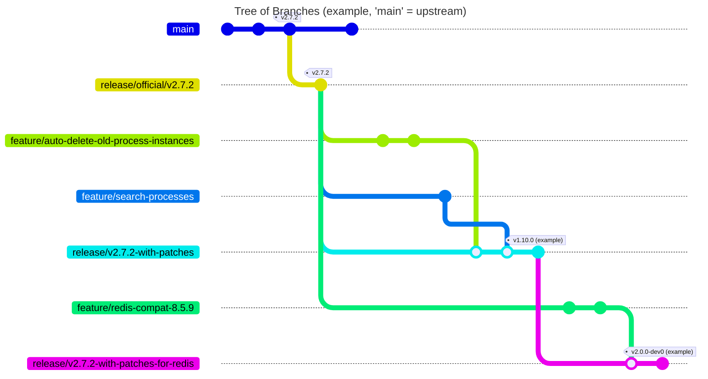

# LYNQTECH PREFACE

> [!WARNING]
> DO NOT MERGE this branch to main or upstream!

> [!NOTE]
> Please update the [Existing patches](#existing-patches) section when creating new patches.

This README describes our process to patch the original `zeebe-simple-monitor`.
This branch exists solely for the purpose to be the default branch in Git, so this section is displayed
per default.

The original fork is maintained in branch `main` as usual; that branch is the source of truth.

<!-- TOC -->

* [LYNQTECH PREFACE](#lynqtech-preface)
* [How to patch zeebe-simple-monitor](#how-to-patch-zeebe-simple-monitor)
  * [Fork of upstream](#fork-of-upstream)
  * [What branches do exist?](#what-branches-do-exist)
  * [What workflow do we use to patch and release the monitor?](#what-workflow-do-we-use-to-patch-and-release-the-monitor)
  * [Rationales](#rationales)
* [Existing patches](#existing-patches)
* [Further reading](#further-reading)

<!-- TOC -->

# How to patch zeebe-simple-monitor

## Fork of upstream

This repository is a fork from https://github.com/camunda-community-hub/zeebe-simple-monitor ("upstream").

As of 11/2024, upstream seems to be dead. It did not get attention anymore from the maintainers, maybe due to the lack
of time, relevance and Camunda's license change.

Due to that license change (commercial use of Zeebe requires a license), it became highly unlikely that a community will
spend any further efforts on the extensions like Zeebe Exporters or Monitors.

## What branches do exist?

This repository maintains

- a fork of upstream in `main`
  - this is the source of truth for all work
  - the branch `local-main` is used to display this section, only.
- release branches on the tag of the upstream releases,
  - e.g. https://github.com/enercity/zeebe-simple-monitor-patches/tree/release/upstream/v2.7.2
- branches for certain patches / additional features / bugfixes that have not been merged upstream, yet
  - e.g. https://github.com/enercity/zeebe-simple-monitor-patches/tree/feature/importer-metrics
  - these are based on top of a release branch
  - so upon new releases, they can be rebased or recreated on top of the new release branch
- branches on top of the official release branches, that merges the features,
  e.g. https://github.com/enercity/zeebe-simple-monitor-patches/tree/release/v2.7.2-with-patches

> [!TIP]
> You must be able to check out every branch and run it locally.

See this example:

- there's some work done in `upstream` which leads to release `v2.7.2`
- we create a `release/official/v2.7.2` branch on that tag
- as well as a `release/v2.7.2-with-patches` branch on that tag
- we develop some `feature/`s on top of the official branch
- we merge these `feature` branches into our `release/-with-patches` branch
- we release from that `release/` branch.

Additional branches to try out things are possible.

## What workflow do we use to patch and release the monitor?

This enables this workflow:

1. pull in new releases from upstream
2. create a new branch from the official release with prefix `release/upstream/v...`
3. create a new branch on top of that `release/v...-with-patches`
4. apply the missing features from the `feature`-branches
   a. fix any issues
5. build a release from the `release/v...-with-patches` branch.

## Rationales

This process provides us with:

- a baseline to add new features/bugfixes by simply creating a `feature` branch from the official release branch
- a ready-to-be-build release branch that contains all patches
- a history in that branch that shows the applied patches
- the possibility to rebase the `feature` branches upon new `release/upstream` branches
- a simple "sync from upstream" process, since no conflicts on `main` expected

# Existing patches

- `feature/auto-delete-old-process-instances` - delete old process instances from database.
- `feature/importer-metrics` - Collect metrics about the import process
- `feature/search-processes` - server side search for processes
- `feature/apt-plugin-deprecated` - fix for the deprecated apt-maven-plugin (incompatible with JDK 23)
- `feature/compat-zeebe-8.5.9` - update dependencies to current Zeebe 8.5.9
- `feature/redis-compat-8.5.9` - integrate Redis on top of Zeebe 8.5.9

# Further reading

That being said, please head over to [main branch](https://github.com/enercity/zeebe-simple-monitor-patches/tree/main)
